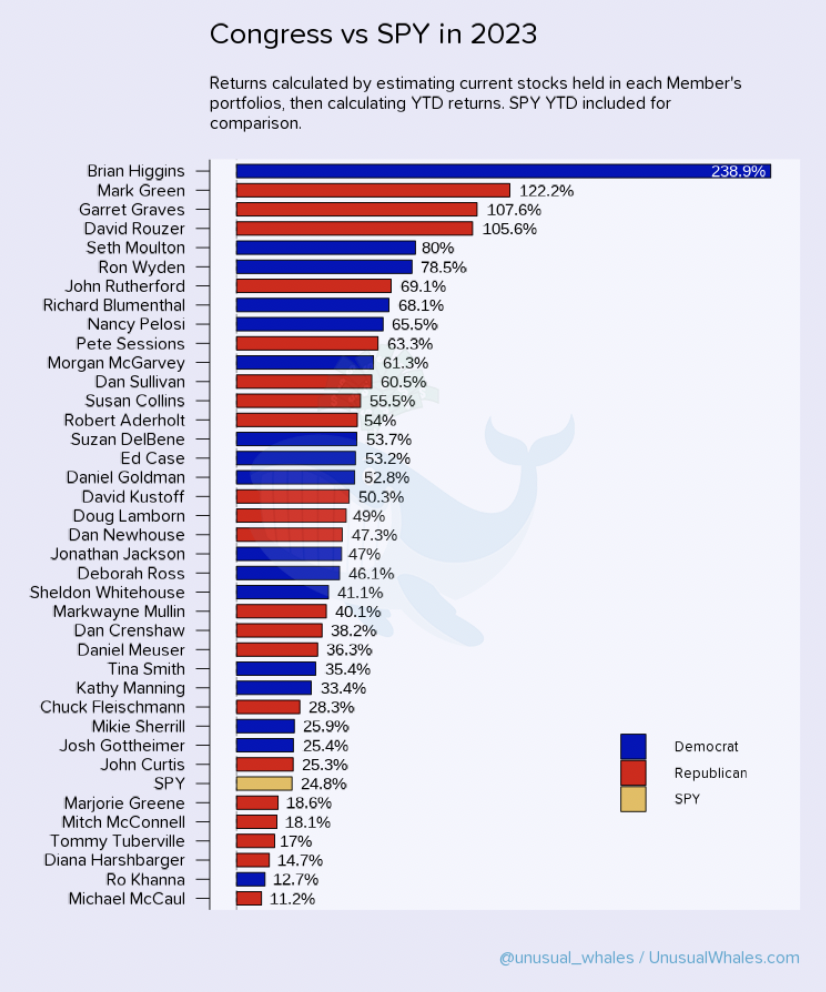

_Author: Chau Cheuk Him, Hung Man Kay, Sean Michael Suntoso, Tai Ho Chiu Hero, Wong Ngo Yin_

The very first step of this group project, as always, is to formulate ideas and check their feasibility. In this blog post, we would like to discuss about the few ideas that we have. More specifically, we discussed about what exactly the topic is about, how NLP could be involved, and the reasons why the proposed topic should and should not be chosen.

## Idea 1: ESG Ratings Prediction

#### ESG Rating and its Significance

The Environmental, Social, and Governance (ESG) score is often used to evaluate a company's strength of commitment to sustainability and responsible business practices. It helps socially responsible investors on making investment decisions by providing insights into the company's sustainability performance.

While ESG rating agencies like MSCI, Sustainalytics and Bloomberg have different methodology, the following are generally considered:

-   Environmental impact (greenhouse gass emissions, energy efficiency, etc.),
-   Social responsibility (diversity and inclusion, product safety, etc.),
-   Coperate governance practices (board composition and diversity, shareholder rights, etc.).

References:

-   [What is #ESG Score and How it is Calculated | LinkedIn](https://www.linkedin.com/pulse/whats-esg-score-how-calculated-koviid-sharma/)
-   [How to Tell If a Company Has High ESG Scores](https://shorturl.at/tPQ37)

#### Literature Review

A growing body of scholarly literature explores the application of natural language processing (NLP) techniques to extract structured data from ESG reports and subsequently analyze them using machine learning models. One such example is the [ESGReveal](https://arxiv.org/html/2312.17264v1) methodology, which employs an LLM-based approach to harness NLP for the extraction of ESG data from corporate sustainability reports, ultimately generating ESG scores for companies.

Furthermore, several pre-trained language models that have been finetuned to ESG-related tasks, such as [ESGBERT](https://huggingface.co/nbroad/ESG-BERT), are available. ESGBERT can be directly used for text classification/ topic identification in the ESG domain as follows:

```python
from transformers import AutoTokenizer, AutoModelForSequenceClassification, pipeline

# load tokenizer and model
tokenizer = AutoTokenizer.from_pretrained("nbroad/ESG-BERT")
model = AutoModelForSequenceClassification.from_pretrained("nbroad/ESG-BERT")

# pipeline for text classification
text_classifier = pipeline('text-classification', model=model, tokenizer=tokenizer)

# perform text classification on a sample list of texts
scores = text_classifier([
    "Our production line releases a lot of carbon dioxide.",
    "Men are paid 3 times more than women.",
])

```

From the above sample texts, the ESGBERT model detects the presence of the topic "GHG_Emissions" with a probability of 78.11% and "Labor_Practices" with a probability of 95.79%.

To build a model that, instead of identifying topics from texts, determines the ESG score, one possible solution is to use the ESGBERT model as a base model and further employ transfer learning to finetune it with extra ESG rating data, such that it can capitalize on the knowledge acquired from extensive text data corpora to perform more specific tasks, i.e. to predict ESG ratings for companies.

Another notable example in the literature is [ESGify](https://huggingface.co/ai-lab/ESGify), a machine learning model capable of predicting ESG scores for companies based on their financial data. This model employs a combination of financial ratios and machine learning algorithms to anticipate a company's ESG score.

#### Challenges and Research Value

If we go with this topic, there might be a lot of challenges ahead since ESG score is usually done and audited manually. We also keep in mind that ESG is a hot topic that will interfered with investor decision, thus this project can be useful when doing due diligence of a company to invest.

## Idea 2: Congress Trading Analysis

#### Background

Congress members have gained a huge financial success in the stock market. Many congress members have been out-performing the market for years, consistently. For example, Nancy Pelosi, is known as one of the best-performing fund managers, has a 65% return in the year 2023, beating the benchmark S&P (with a 24% upside) by 2.7 times. Below is a chart showing the return of Congress members VS SPY in 2023. You can see that Congress outperformed SPY a lot in 2023.



(Image from [Congress Trading Report 2023](https://unusualwhales.com/politics/article/congress-trading-report-2023#tldr))

#### References of similar works

By looking into social media and tweets from policy-makers, we may be able to gain some valuable investment insights or even make profits from their trading history. Some previous works could be referenced on this project topic:

1. [Congress copy-trade Github repo](https://github.com/sa1K/Congressional-Stock-Trading/tree/main)
2. [Congress Debate History, can be used for NLP](https://www.govinfo.gov/app/collection/crec/2024/01/01-02/3)
3. [Another website tracking Congress movement, could be used for NLP](https://www.govtrack.us/)
4. [This is a community-run project to develop Python tools to collect data about the bills, amendments, roll call votes, and other core data about the U.S. Congress into simple-to-use structured data files.](https://github.com/unitedstates/congress)
5. [Twitter of Nancy Pelosi, contains tweets](https://twitter.com/SpeakerPelosi)
6. [Uses Selenium to scrape and make transcations in robinhood based on weighted sum of all politician trades](https://github.com/sa1K/Congressional-Stock-Trading/tree/main)
7. [Contains Open-Data for US Government](https://www.datacoalition.org/)
8. [Trace Congress party on their equity traded](https://www.capitoltrades.com/trades?per_page=96&politician=P000197#)

#### Code Skeleton

Below are the proposed procedures to process the data:

1. Available datasets can be used directly or after being converted to texts using Optical Character Recognition (OCR). If data are insufficient, web-scraping with Selenium can be done as follows.

```python
from selenium.webdriver.chrome.options import Options
from selenium import webdriver
import pandas as pd
import scrape

# setting up drivers
chrome_options = Options()
chrome_options.add_experimental_option("detach", True)
driver = webdriver.Chrome(options=chrome_options)

trades = pd.DataFrame()
page = 1
while page <= 3:
    # time.sleep(3.5)
    trades2 = scrape.trade_list(
        driver, "https://www.capitoltrades.com/trades?per_page=96&page=" + str(page)
    )
    trades = pd.concat([trades, trades2], ignore_index=True)
    page = page + 1

```

2. Write the scrapped content to .csv for further processing
3. Data cleaning, dataset merging, data pre-processing
4. Perform Natural Language Processing (NLP) model training and testing on the crawled textual data
5. Signal generation: A classification problem -> [-1, 1], map it to specific market, perform Sentiment Analysis and provide confidence score [-1,1] to determine to SHORT/LONG the corresponding ETF
6. (Potential work): Correlation matrix to validate whether there's a correlation between Congress transaction history & the time they deliver the speeches

    OR passing certain acts & equities' price upstrike/downstrike, so we can determine who is the real "smart-money"

#### Challenges

1. Dataset pre-processing might not be easy as data sources are not same
2. Twitter API is not completely free. Free users have limited access to the API functionalities.
3. The usefulness of the signal: using NLP to analyse the speech of Congress might not be that useful, in a way that speeches are often delayed (the stock price usually change right after the speech/act is delivered/established). Nevertheless, the correlation matrix might help us distinguish who is the real smart-money, and then we can simply do copy-trade based on majority vote consensus on top-gainers (that has a high win-rate).

