_Author: Chau Cheuk Him, Hung Man Kay, Sean Michael Suntoso, Tai Ho Chiu Hero, Wong Ngo Yin_

In today's rapidly evolving investment landscape, Environmental, Social, and Governance (ESG) factors have gained significant recognition as key drivers of long-term value creation. According to Bloomberg Intelligence, a staggering 85% of investors agree that incorporating ESG considerations can lead to superior returns, bolster portfolio resilience, and enhance fundamental analysis. Projections indicate that by 2030, ESG investing is expected to account for a substantial portion, approximately US$40 trillion or 25%, of the total projected assets under management worldwide. Recognising the significance of ESG in investment decision-making, we have embarked upon the development of an ESG risk levels predictor, aimed at assisting investors in making informed and responsible investment choices.

## 1. Background Information

### 1.1. What are ESG scores and ESG risk levels?

ESG scores and ESG risk levels are two distinct measures used to assess environmental, social, and governance (ESG) factors. ESG scores provide a comprehensive evaluation of a company's overall sustainability and responsible business practices, considering a wide range of ESG criteria. These scores reflect the company's commitment to sustainability and its ability to manage ESG risks and opportunities effectively. On the other hand, ESG risk levels focus specifically on quantifying the potential risks associated with a company's ESG practices, assessing factors such as carbon emissions, labor practices, and regulatory compliance. There are 5 ESG risk levels: “Negligible”, “Low”, “Medium”, “High” and “Severe”, which provide investors with an assessment of the potential downside risks. Due to this different objective, ESG score is not always correlate with ESG Risk Level. 

### 1.2. The Significance of ESG Scores and ESG Risk Levels

Fund managers seeking to align their investment strategies with ESG principles often rely on ESG scores and risk level to identify potential investments for inclusion in ESG-focused exchange-traded funds (ETFs) and other sustainable investment products. Our ESG scores and risk levels predictor aims to leverage advanced data analytics and machine learning techniques to predict and generate accurate ESG scores and risk level for companies, empowering investors with valuable information for their investment decision-making processes.

### 1.3. Benefits of ESG Risk Levels and ESG Score Predictor

ESG risk levels and score predictors hold significant potential to revolutionise the investment landscape by providing investors with a reliable tool to evaluate the sustainability performance of companies. By harnessing the power of data analytics and machine learning algorithms, our predictor offers the following benefits:

1. Enhanced Investment Decision-Making: Investors can make more informed choices by incorporating ESG scores into their investment analysis. Our predictor enables investors to identify socially responsible companies with strong sustainability practices, aligning their investments with their values.
2. Risk Mitigation: By evaluating a company's environmental and social practices, investors can identify potential risks, such as regulatory non-compliance or reputational damage. Our predictor assists in identifying companies with robust governance frameworks, thereby reducing investment risks.
3. Sustainable Impact: Through the promotion of ESG investing, our predictor contributes to the broader goal of driving positive change in corporate behaviour. By rewarding companies with strong ESG practices, investors can incentivise sustainable practices and foster a more responsible business environment.

Therefore, we decided to develop models to predict ESG Risk Levels and ESG Score as our project.

## 2. Data Gathering and Pre-processing
We gather data from two different source. 

1. [Table consist of ESG Risk Level and Score](https://www.kaggle.com/code/mauriciovellasquez/esg-risk-analysis-insights-from-s-p-500-companies) 
2. [Table consist of Earnings Call Transcript](https://www.kaggle.com/datasets/tpotterer/motley-fool-scraped-earnings-call-transcripts)

Firstly, we proceed by merging the data based on the Ticker and removing any rows that contain invalid or empty data before 2022. Subsequently, we eliminate the Q&A section from the transcript to reduce its length. In order to further condense the transcript for analysis purposes, we employ ESG-BERT to classify sections that are relevant to environmental, social, and governance (ESG) topics. This process results in an average word count reduction from 3012 to 1298. Additionally, we employ stop-word removal and lemmatization techniques before splitting the data into test and train sets.

Upon examining the ESG score chart, we observe a left-skewed distribution, indicating that a larger number of companies possess lower ESG scores.

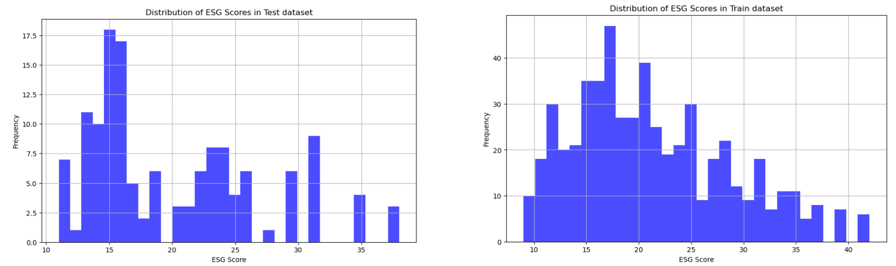


This data imbalance can introduce bias towards the majority class in our model. To address this concern, we employ class weighting techniques during the model development phase to mitigate the impact of this imbalance.

## 3. Development with Different Base Model
### 3.1. ESG-Bert Fine-tuning
#### 3.1.1. Motivation
In this project, we actually focused on the BERT model for predicting ESG scores and risk levels.

One of the main advantages of using BERT is its relatively lower computational resource requirements compared to other well-known powerful models like ChatGPT and Llama. BERT's lightweight nature allows us to achieve optimal performance even with medium-range GPUs. In contrast, getting the full potential of ChatGPT or Llama would require significantly more resources, which is not feasible for us. This accessibility and efficient use of limited resources make BERT a more practical choice for us.

Besides, BERT's architecture is particularly well-suited for classification tasks, such as predicting ESG risk levels. It allows for straightforward application to classification problems, like predicting ESG risk levels in this project. In contrast, generative models like ChatGPT and Llama, despite their impressive capabilities, can be less intuitive for classification tasks due to their autoregressive nature.

Another reason to choose BERT is its proven effectiveness in a variety of NLP tasks. As an older model compared to Llama or ChatGPT (BERT was published in 2018), BERT has been widely adopted and successfully applied across numerous research projects, giving us confidence in its ability to deliver strong results for ESG prediction tasks.

Furthermore, there are already fine-tuned models specifically designed for ESG-related tasks. These models demonstrate the potential of BERT for addressing the unique challenges associated with predicting ESG scores and risk levels.

ESG-Bert is one of the fine-tuned model available online. It is a **Classification** Natural Language Processing model fine-tuned for dealing with ESG-related data **classification** tasks. We are trying to fine-tune this model with our dataset for predicting the ESG scores and ESG risk level. We believe this approach would yield the best results.

#### 3.1.2. Work Done
```python
model= BertForSequenceClassification.from_pretrained('nbroad/ESG-BERT', num_labels=num_classes, ignore_mismatched_sizes=True)
model.classifier = torch.nn.Linear(model.config.hidden_size, num_classes)
```
We load the pre-trained ESG-Bert model and set its classifier as above for classifying the ESG risk level. On the other hand, if we would like to predict ESG scores, we have to replace the classification head with a linear layer to a continuous value.

```python
model= BertForSequenceClassification.from_pretrained('nbroad/ESG-BERT')

# For regression, we need to remove the classification head that outputs logits for classes
model.classifier= torch.nn.Linear(model.config.hidden_size, 1)
```
We then proceed to fine-tune. As mentioned, we have to deal with the data imbalance case.

```python
num_classes= len(label_encoder.classes_)
class_weights= torch.tensor([1.0/ train['esg_risk_level'].value_counts()[i]for iin range(num_classes)], dtype=torch.float)# Explicitly define as floatclass_weights= class_weights/ class_weights.sum()* num_classes
model= BertForSequenceClassification.from_pretrained('nbroad/ESG-BERT', num_labels=num_classes, ignore_mismatched_sizes=True)
model.classifier= torch.nn.Linear(model.config.hidden_size, num_classes)
optimizer= AdamW(model.parameters(), lr=5e-5)
criterion= torch.nn.CrossEntropyLoss(weight=class_weights.to(torch.device("cpu")))# Ensure weights are on the correct device and float

train_loader = DataLoader(train_dataset, batch_size=16, shuffle=True)
device = torch.device("cpu")  # Use "cuda" if you have GPU
model.to(device)

# Training Loop
model.train()
for epoch in range(3):
    for batch in tqdm(train_loader, desc=f"Training Epoch {epoch+1}"):
        optimizer.zero_grad()
        
        input_ids = batch['input_ids'].to(device)
        attention_mask = batch['attention_mask'].to(device)
        labels = batch['labels'].to(device)
        
        outputs = model(input_ids, attention_mask=attention_mask)
        loss = criterion(outputs.logits.float(), labels)  # Ensure logits are FloatTensor
        
        loss.backward()
        optimizer.step()
```
#### 3.1.3. Model Setup With Class Weights to Handle Imbalance Data
To handle the imbalance, we calculated class weights for each ESG risk level. This approach helps the model treat each risk level fairly during the training process by giving more importance to less frequent classes. Essentially, we're telling the model that it's just as crucial to learn from the rarer ESG risk levels as it is from the more common ones.

Another important aspect of our approach is the choice of the CrossEntropyLoss function. This loss function is specifically designed for multi-class classification problems, making it a suitable choice for predicting ESG risk levels. By incorporating class weights into the loss function, we further ensure that the model gives equal attention to all ESG risk levels during training, leading to a more accurate and well-rounded prediction capability.

#### 3.1.4. Findings

Below is the performance of the fine-tuned ESG-Bert model. We also try the performance of the vanilla ESG-Bert model (without any fine-tuning) on our dataset to set a benchmark.

| ESG risk level prediction accuracy | Vanilla ESG-Bert | Fine-tuned ESG-Bert |
| --- | --- | --- |
| Training data | 27.8% | 51.4% |
| Testing data | 21.7% | 46.4% |

| ESG score prediction on testing data | Vanilla ESG-Bert | Fine-tuned ESG-Bert |
| --- | --- | --- |
| MSE (Mean Squared Error) | 452.555 | 62.933 |
| MAE (Mean Absolute Error) | 20.134 | 20.134 |

We see an obvious improvement after fine-tuning, but the performance is a bit below our expectations. Despite the current accuracy not being exceptionally high, we believe the fine-tuned ESG-BERT model still holds a certain level of usefulness. The improvements over the vanilla model indicate that it has learned to adapt to our specific dataset and task. As we continue to refine our approach, with BERT or ESG-Bert, we expect the model's performance to improve, making it a valuable tool for predicting ESG risk levels and scores in the future.

### 3.2. Llama-2 Fine-tuning
#### 3.2.1. Motivation

Llama2 is a collection of pre-trained and fine-tuned large language models developed by Meta AI and released in 2023. These models are freely available for both research and commercial use. Llama2 AI models possess the ability to perform diverse natural language processing tasks, ranging from text generation to programming code analysis.  **Llama2 is one of the strong LLM models, has been in used for fine-tuning for a while and is widely acknowledged to be even more powerful than BERT in general.** Therefore, we believe that utilising this model will yield significant results and valuable comparisons. As such, it is worthwhile to provide a more detailed account of our methods and the work we have undertaken.

We decided to use *Llama-2-7b-chat-hf*, the Llama-2 model with 7 billion parameters from HuggingFace for fine-tuning. There are versions with 13b and 70b parameters, which are much more powerful. However, since we have limited resources (GPU), we have to use this smaller model to try and compute everything in a reasonable runtime.

#### 3.2.2. Work Done
To access the Llama-2 model, we have to do the following:

First, visit https://llama.meta.com/llama-downloads/ and request access to Meta Llama with our email address. After receiving the permission email, log in to Hugging Face account on the Llama-2 model page at https://huggingface.co/meta-llama/Llama-2-7b-chat-hf, and request access to the model repository.

Once gained access to the model repository, set up the development environment by installing the Hugging Face Hub library. Run `pip install huggingface-hub` in the environment and authenticate the registered account by running `huggingface-cli login`. This will your account and grant you access to the Llama-2 model.

With these steps completed, we can finally access the model with this line of code:

```python
base_model = "meta-llama/Llama-2-7b-chat-hf"
```
We fine-tuned the Llama-2 model by the following approach:

```python
def combine_question_answer(transcript_esg, esg_risk_level):
    system_msg = "<<SYS>>\n" \
        + "You are an rating agency. Your task is to predict the a company's ESG Risk Level from a meeting transcript." \
        + "You should evaluate the company's performance on Environmental, Social and Governance issues." \
        + "The possible Risk Levels, from low to high, are `Negligible`, `Low`, `Medium`, `High`, `Severe`.\n" \
        + "<</SYS>>\n\n"
    prompt = f"<s>[INST] {system_msg}###Transcript: {transcript_esg}###Risk Level: [/INST] `{esg_risk_level}`</s>"
    return prompt

df_train["text"] = df_train.apply(
    lambda row: combine_question_answer(row.transcript_esg, row.esg_risk_level), axis=1
)
```

The purpose of creating this prompt is to make it super easy for our model to understand its mission. It's like giving it a treasure map and a set of instructions to follow.

The `combine_question_answer` function is like a magical spell that mixes three essential ingredients:

1. **System message**: A friendly note that tells our model what it's supposed to do. It's like saying, "Hey buddy, you're a rating agency, and you need to figure out a company's ESG Risk Level from this meeting transcript. Oh, and here are the possible Risk Levels you can choose from!"
2. **Transcript**: This is the treasure map! It's the meeting transcript that our language model have to use to complete its mission.
3. **Risk Level**: This is the final destination, the X on the treasure map. It's where our model should place the predicted ESG Risk Level.

By creating this fun and structured prompt, we're helping our language model learn more effectively and become a pro at predicting ESG Risk Levels from meeting transcripts. 

We then utilised the QLoRA (Quantised Low Rank Adaptation) method for fine-tuning our model. This approach is a type of PEFT (Parameter Efficient Fine Tuning) technique, which focuses on minimising the number of trainable parameters within a neural network. By optimising memory usage, QLoRA significantly reduces the time required for training. This time-saving advantage enables us to advance our project efficiently, even under tight time constraints.

```python
peft_params= LoraConfig(
    lora_alpha=16,
    lora_dropout=0.1,
    r=64,
    bias="none",
    task_type="CAUSAL_LM",
)
```

By fine-tuning the Llama-2 model in this manner, we can effectively compare its performance with that of our main project focus, the ESG-BERT model, to determine the more accurate and efficient solution for assessing ESG risk levels.

#### 3.2.3. Findings

The training and testing accuracies achieved by the fine-tuned Llama-2 model stand at 40.3% and 29.5%, respectively. The ESG-BERT model has demonstrated superior performance with an exact same dataset. This is likely because we are using the "weakest" Llama-2 model, with the least number of parameters, due to our limited computational resources. This constraint creates a bottleneck, preventing us from further improving the model's performance. **As a result, we decided not to proceed with ESG score prediction and stopped at this point.**

### 3.3. BERT Fine-tuning
#### 3.3.1. Motivation
Since the performance of ESG-BERT is not yet optimal, and we believe that BERT models have the potential to yield good results, we have also decided to directly utilise BERT and fine-tune it for this project. 

#### 3.3.2. Work done

Here are the codes and parameters that we use.  

```python
BASE_MODEL = "google-bert/bert-base-uncased"
LEARNING_RATE = 1e-4
MAX_LENGTH = 512
BATCH_SIZE = 12
EPOCHS = 32

tokenizer = AutoTokenizer.from_pretrained(BASE_MODEL)
model = AutoModelForSequenceClassification.from_pretrained(BASE_MODEL, num_labels=1)

training_args = TrainingArguments(
    output_dir=f"checkpoints/bert_finetuned_{timestamp}/",
    learning_rate=LEARNING_RATE,
    per_device_train_batch_size=BATCH_SIZE,
    per_device_eval_batch_size=BATCH_SIZE,
    num_train_epochs=EPOCHS,
    evaluation_strategy="epoch",
    logging_strategy="epoch",
    save_strategy="epoch",
    # metric_for_best_model="mse",
    greater_is_better=False,
    save_total_limit=2,
    load_best_model_at_end=True,
    weight_decay=0.01,
    report_to="none",
)

trainer = Trainer(
    model=model,
    args=training_args,
    train_dataset=dataset_train,
    eval_dataset=dataset_val,
    compute_metrics=compute_metrics_for_regression,
)

warnings.filterwarnings("ignore")
trainer.train()
```

The work flow is basically the same as how we fine-tune the ESG-BERT model. 

#### 3.3.3. Findings

After training the model, here is the result of the ESG Score and Risk Level predictor model in train and test dataset. On the best case scenario, **we manage to train a model with accuracy rate of above 75% on train data and above 52% in test data, which is higher than random guess and ESG-BERT fine-tuning that only have 51% accuracy for ESG Risk Level.** 

We also noticed that the ESG score predictor is capped at 26. This might be due to the class imbalance that resulting in ESG score prediction by our model less likely to give score of higher than 26. With this, **we calculate that our model can achieve MSE at 16.3790 and 27.7570** for training and testing dataset respectively, **which is also better than ESG-BERT fine-tuning**.

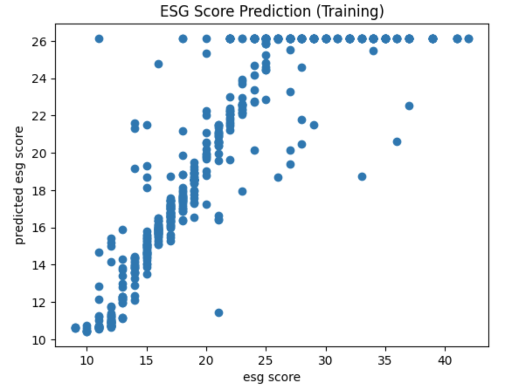
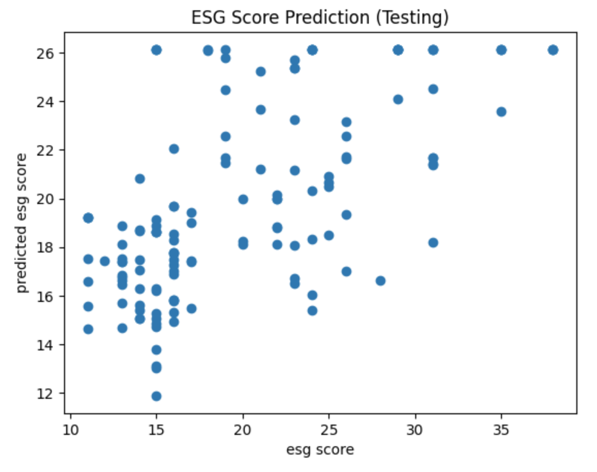

## 4. Deployment
Since we think that deploying the model to visualise the result would make the presentation more appealing than plain code, we deployed our model using Python Flask. 

At first, the deployment model do not have a very friendly GUI. It contains only one input field and returns a JSON string after `Search` is clicked. 

### 4.1. Original GUI

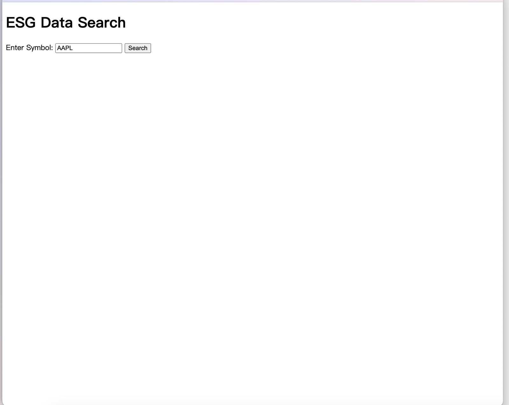

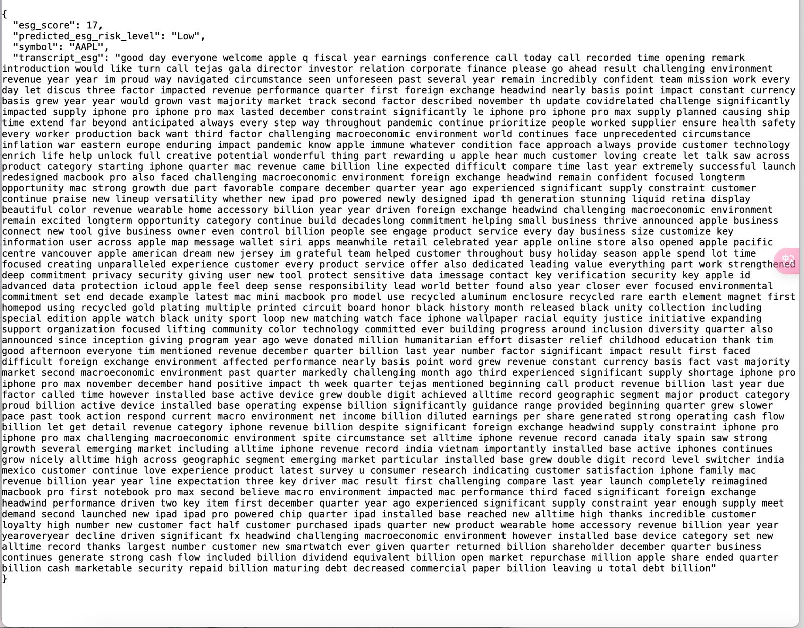

### 4.2. What we want to achieve

We have had some discussions and think that a GUI that looked like this would look better.

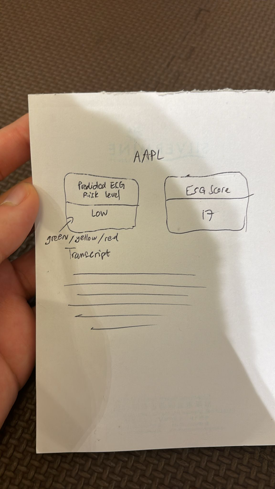

### 4.3. Leveraging GenAI

So we put both our code + the image above into ChatGPT, and asked how we could use Bootstrap to create a GUI like the image as shown above. 

- Conversation with ChatGPT
    
    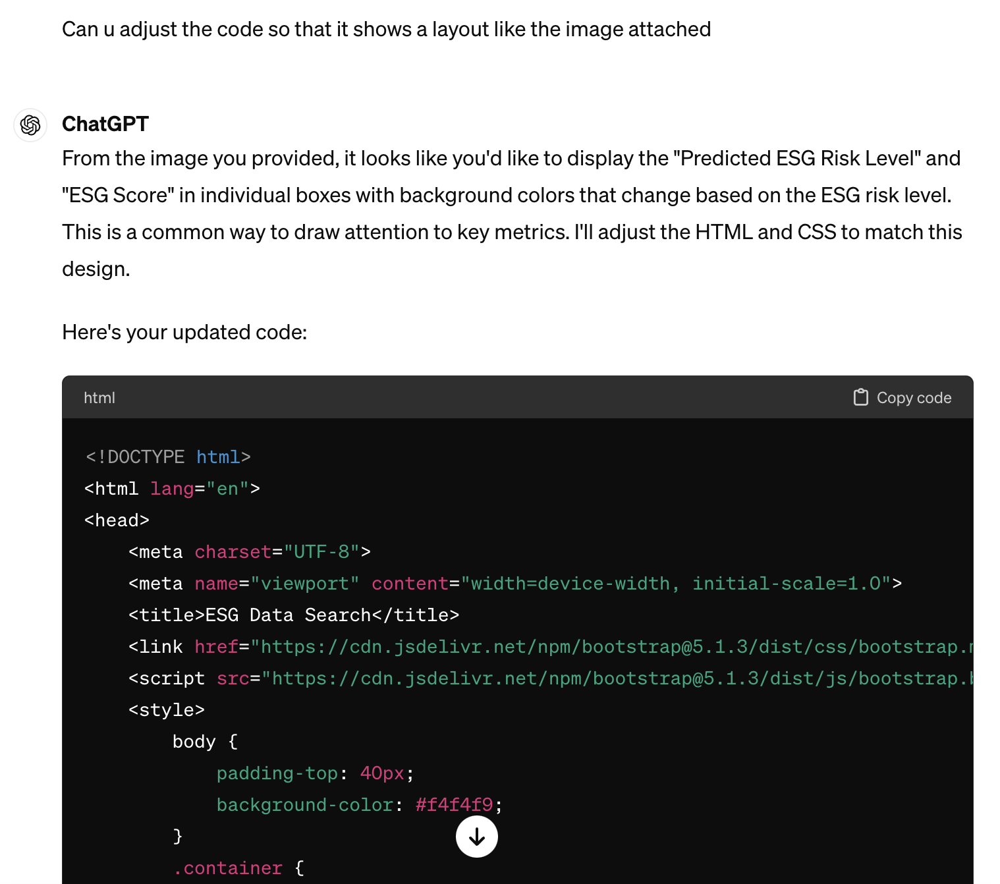
    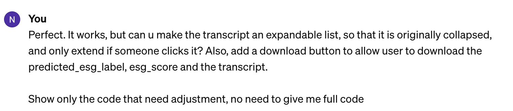
    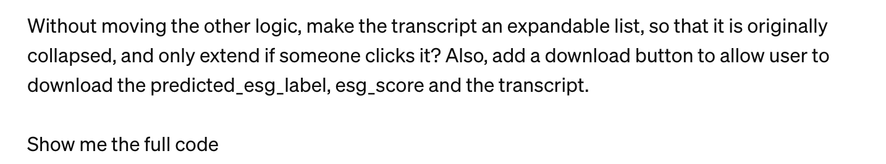
    

After prompt engineering and finetuning the code provided, we refined the GUI. Also, we added the “Download Data” function so that users can download the predicted esg risk level, esg score, and ESG-related transcript into a .txt file for further processing. 

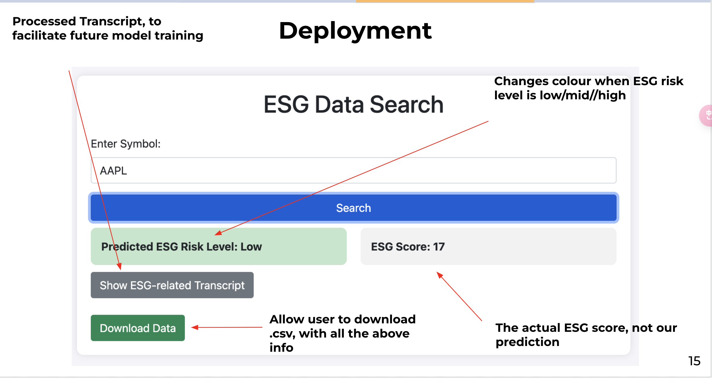

1. Run the python server 

```jsx
python ./{directory}/deploy_model.py 
```

2. Open the HTML file `index.html`

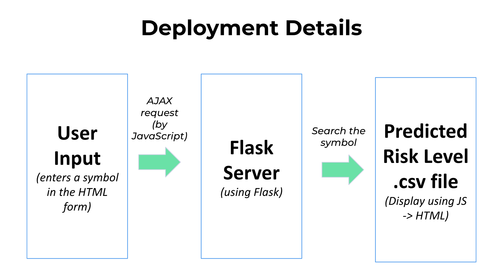

Below is the workflow of the deployment: 

Case I: User enters a stock symbol in the HTML form and clicked `Search`: 

1. JavaScript Handling:
Captures the form submission and prevents default submission, sends a AJAX request with the symbol to Flask server
2. Python (Flask) Processing:
Receives AJAX request -> Searches in our predicted risk level.csv (which is the saved output result from the previous process)  -> Sends back response (ESG data or error message) ->
3. JavaScript Updates HTML:
    
    Receives response from Flask server -> Updates HTML to display ESG data or an error message -> If data received, shows download button 
    

Case II: User clicks the `Download` : 

1. User clicks download button -> JavaScript triggers file download

## 5. Summary

In this blog post, we discuss our findings and experiences in developing a good model to predict ESG risk levels by fine-tuning ESG-BERT, Llama2 and BERT. We discovered that directly fine-tuning the BERT model yielded even more promising results than fine-tuning the ESG-BERT model, which was initially expected to perform better on ESG-related tasks. As a result, we suggest focusing on this direction in future work.

And to make the presentation more appealing and showcase the results effectively, we deployed our model using Python Flask. This approach allowed us to visualise the results in a more interactive and user-friendly manner compared to plain code.

One challenge we faced was the limited performance of the Llama2 version feasible to us. Computational resources proved to be a significant issue when working on this project.

For future work, we aim to improve the accuracy of our model using BERT as the base model. To achieve this, we propose the following enhancements:

- Expanding the dataset to include more companies and years of transcripts
- Incorporating additional data sources such as news articles and media coverage
- Conducting advanced feature engineering to explore and create additional relevant features
- Leveraging domain knowledge and external data sources to enrich the feature set

By implementing these improvements, we hope to develop a more robust and accurate ESG risk level prediction model, ultimately providing investors with a valuable tool for evaluating companies' sustainability performance.